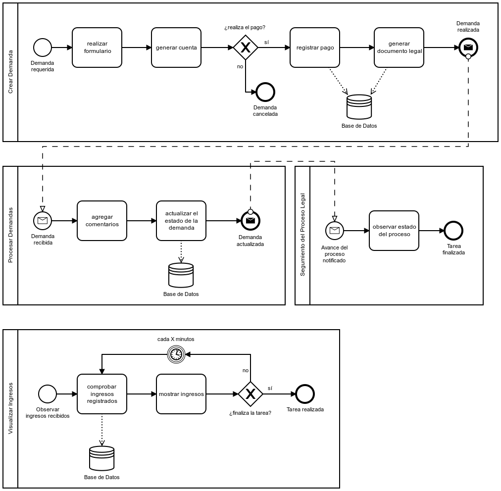
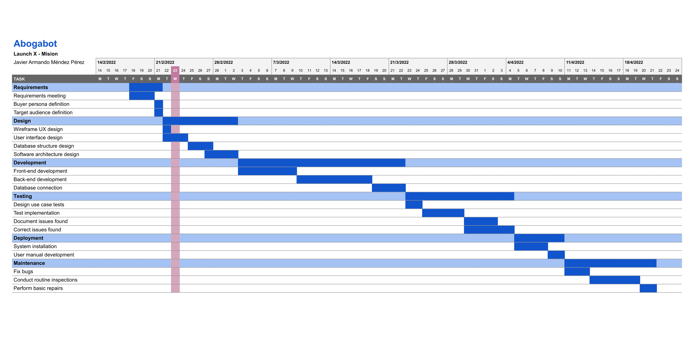
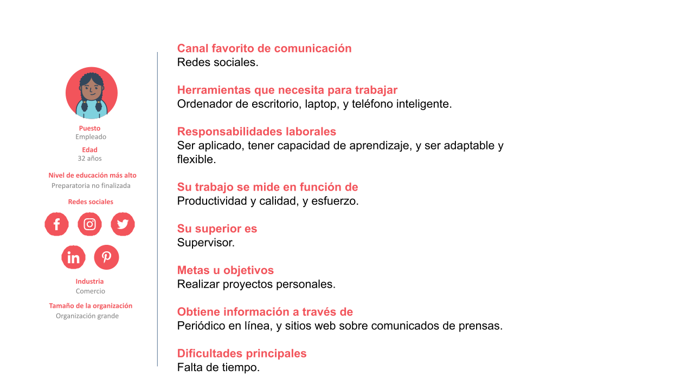
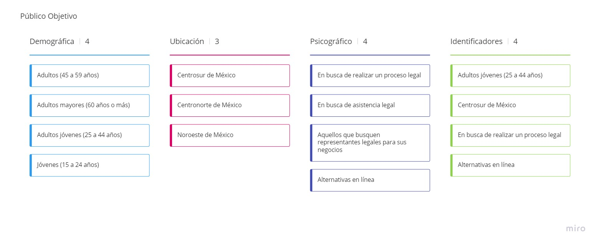
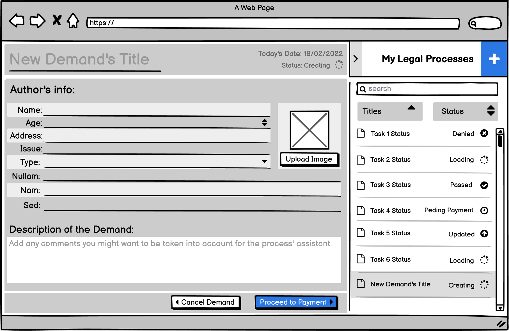
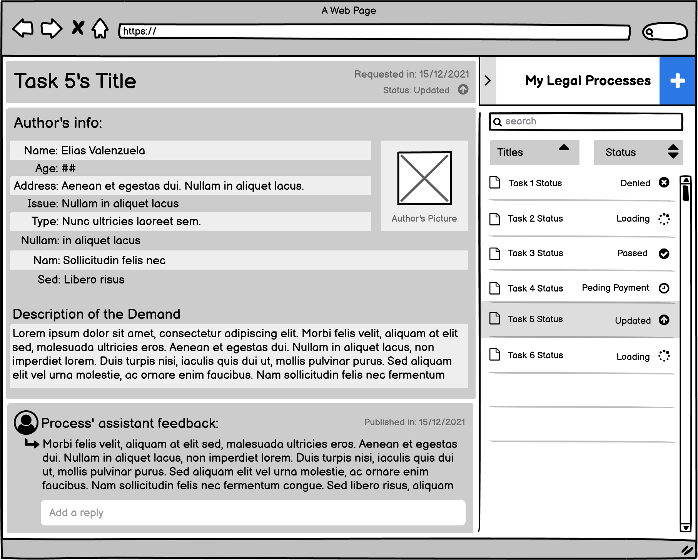
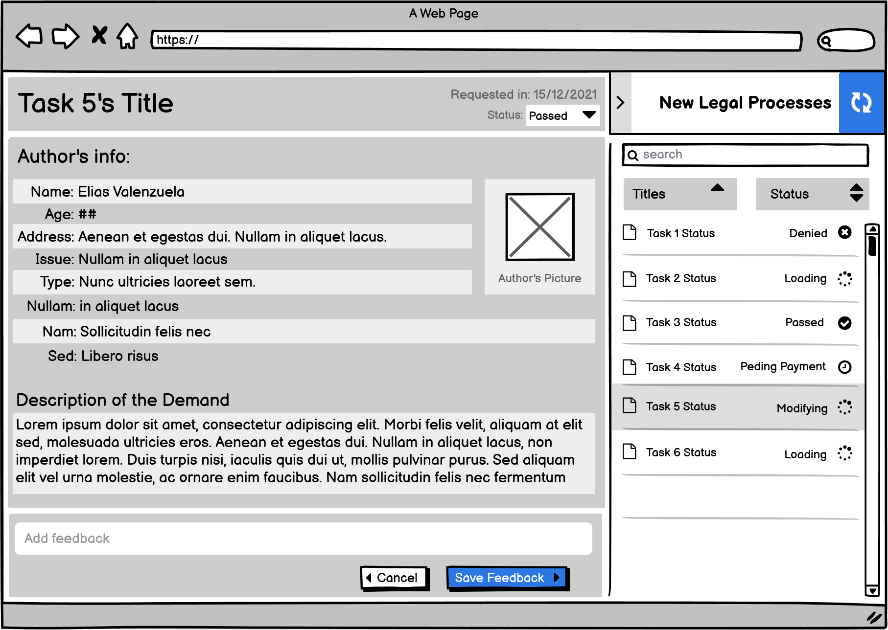
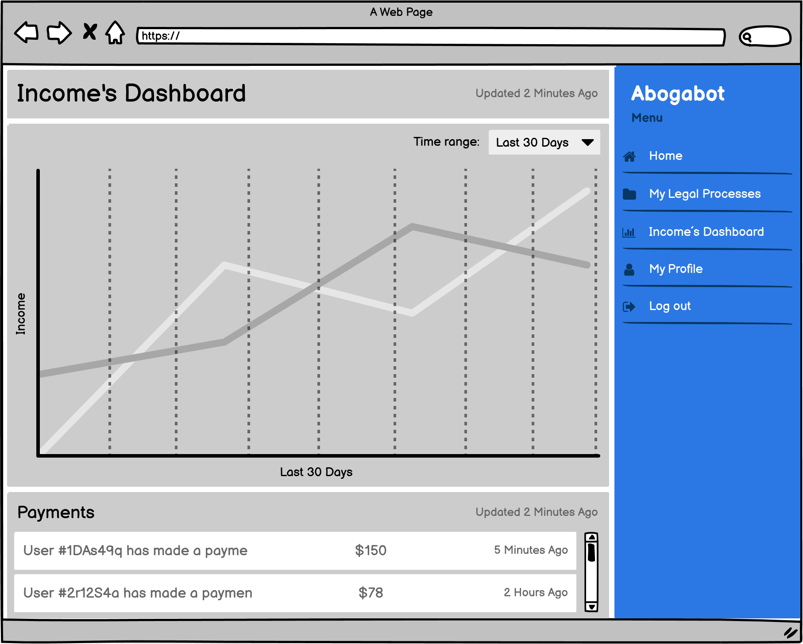
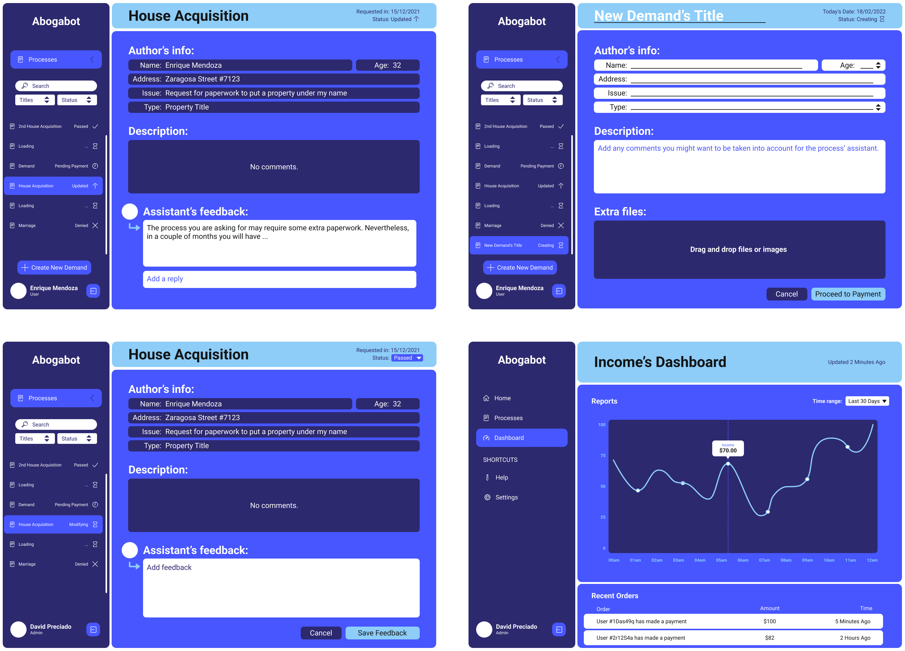

<!-- PROJECT LOGO -->
 

  

<h3 align="center">Launch X - Front-end INTRO</h3>

  

    Assignments from the first week of Launch X's frontend introduction course.
     
    <a href="https://github.com/javiermendez-coder/LaunchX-FrontEnd-00-intro"><strong>Explore the docs »</strong></a>
     
     
    <a href="https://github.com/javiermendez-coder/LaunchX-FrontEnd-00-intro/issues">Report Bug</a>
    ·
    <a href="https://github.com/javiermendez-coder/LaunchX-FrontEnd-00-intro/issues">Request Feature</a>
  

<!-- TABLE OF CONTENTS -->

  
Table of Contents

  <ol>
    <li>
      <a href="#about-the-project">About The Project</a>
      <ul>
        <li><a href="#requirements-meeting">Requirements Meeting</a></li>
      </ul>
      <ul>
        <li><a href="#creation-of-our-buyer-persona">Creation of our buyer persona</a></li>
      </ul>
      <ul>
        <li><a href="#define-the-target-audience">Define the target audience</a></li>
      </ul>
      <ul>
        <li><a href="#creation-of-the-wireframe">Creation of the Wireframe</li>
      </ul>
      <ul>
        <li><a href="#design-the-ui">Design the UI</a></li>
      </ul>
      <ul>
        <li><a href="#software-and-web-pages-used">Software and web pages used</a></li>
      </ul>
    </li>
    <li><a href="#contact">Contact</a></li>
    <li><a href="#acknowledgments">Acknowledgments</a></li>
  </ol>

---
<!-- ABOUT THE PROJECT -->
## About The Project

<!-- [![Product Name Screen Shot][product-screenshot]](https://example.com) -->

This project stands on raising requirements, create a buyer persona, define the target audience, design a wireframe, and design the UI of the given case: [Abogabot](https://github.com/LaunchX-InnovaccionVirtual/FrontEnd-Mision/tree/main/01%20-%20INTRO/practicas/README.md).
  

(<a href="#top">back to top</a>)

### Requirements Meeting

As I mentioned before this project starts with the raise of requirements, defining what would be part of the web application and what not. A template were recommended to achieve this task, in which you can find this case solved [here](./00-requirements.docx). 

Some of the tasks done in said document were:

- Develop a BPMN (Bussiness Process Model and Notation). 

Here are the core tasks that I personally thought as fundamental, so that is why I created a BPMN for each one.
  

- Create a Gantt chart to stablish the amount of design time for every requirement.

Yes, this Gantt chart may seem too optimistic. Nevertheless, this is nothing but a roughly estimated schedule trying to stick "realisticly" with the other assignments that we should work with in the Abogabot case.
  

(<a href="#top">back to top</a>)

### Creation of our buyer persona.

Something I would like to clarify first is that I created the buyer persona after defining my target audience, since (at least for me) is easier to use the general-to-specific order. With this already clarified I can start explaining my though process to create the buyer persona. 

- The buyer persona has to be familiarized with the concept of internet and online processes, so he/she won't struggle trying to understand what the purpouse of the web page is and how to use it.

- The buyer persona's job responsibilities has to be learning capability, and be adaptable and flexible, so if he may run into some unknown features he won't back up.

- The buyer persona has not enough time to schedule daily or weekly meetings with a lawyer in person, so he/she would look for an asynchronous alternative way to have assistance with the legal processes that he/she needs to take care of.

- The buyer persona has to be a common worker with an averwage wage, so he/she would look for a fair cost-benefit service.

- The buyer persona has to be a young adult, so he/she would lack the knowledge on how to start or follow a legal process and may need some legal assitance.

(<a href="#top">back to top</a>)

### Define the target audience

Using the Google Trends tool I found which México's states look up the most for "abogados" (word in spanish for "lawyers") and that's how I ranked the regions. Also, the identifiers column is where I took the most important cards and with that ones is how I derived to create the buyer persona, as I explained before.

(<a href="#top">back to top</a>)

### Creation of the Wireframe

Create Demand

Demand's Info

Update Process Status

Visualize Income

(<a href="#top">back to top</a>)

### Design the UI

From right to left and top to bottom are the views: 

  <table>
    <tr>
      <td>1. Demand's info</td>
      <td>2. Create demand</td>
    </tr>
    <tr>
      <td>3. Update Process Status</td>
      <td>4. Visualize Income</td>
    </tr>
  </table>

Yeah, I know it doesn't look quite impresive, but that was my best effort. (⊙_⊙;)

(<a href="#top">back to top</a>)

### Software and web pages used

* [BPMN.io](https://bpmn.io)
* [Google Docs](https://docs.google.com)
* [Google Sheets](https://sheets.google.com)
* [Google Slides](https://slides.google.com)
* [Google Trends](https://trends.google.com)
* [Miro](https://miro.com)
* [Balsamiq](https://balsamiq.com)
* [Figma](https://www.figma.com)
* [FlatIcon](https://www.flaticon.com)
* [Coolors](https://coolors.co)

(<a href="#top">back to top</a>)

---
<!-- CONTACT -->
## Contact

Javier Méndez - javiermendez0299@gmail.com

Project Link: [https://github.com/javiermendez-coder/LaunchX-FrontEnd-00-intro](https://github.com/javiermendez-coder/LaunchX-FrontEnd-00-intro)

(<a href="#top">back to top</a>)

